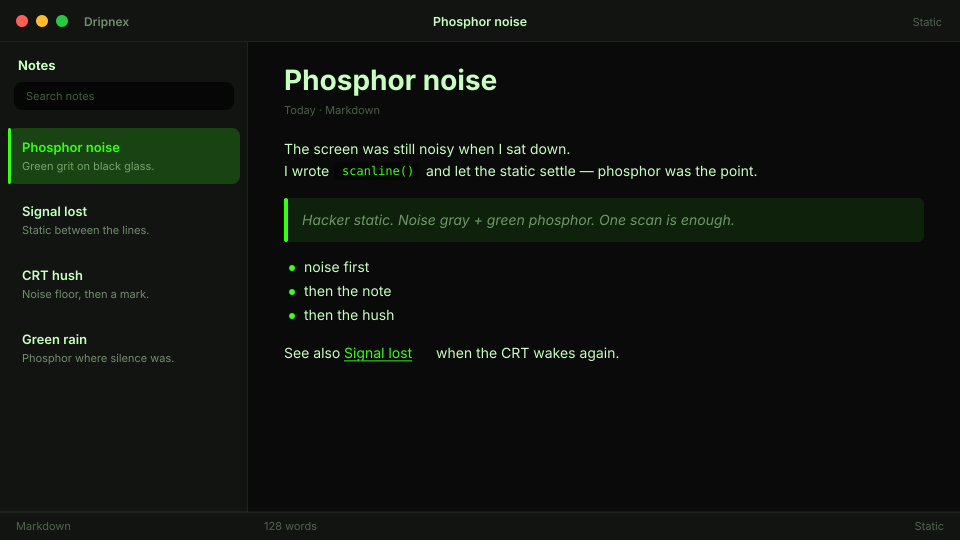

# Static

Hacker static. Noise gray + green phosphor.



```
dripnex/theme-static
```

## Palette

The chips live in [palette.html](palette.html) — open it in a browser. GitHub won’t paint HTML swatches here, so the hex list is below.

| Name | Token | Color | What it’s for |
| --- | --- | --- | --- |
| Base | `--bg-base` | `#0a0a0a` | Window background |
| Surface | `--bg-surface` | `#121412` | Sidebar and chrome |
| Elevated | `--bg-elevated` | `#1a1e1a` | Raised panels |
| Text | `--text-primary` | `#c8ffc0` | Headings and body |
| Muted | `--text-muted` | `#c8ffc0 · rgba(200, 255, 192, 0.52)` | Secondary copy |
| Accent | `--accent` | `#39ff14` | Selection and links |
| Active | `--status-active` | `#39ff14` | Active status |
| Dropped | `--status-dropped` | `#cf6875` | Dropped status |

Pick it for the mood: Hacker static. Noise gray + green phosphor.
